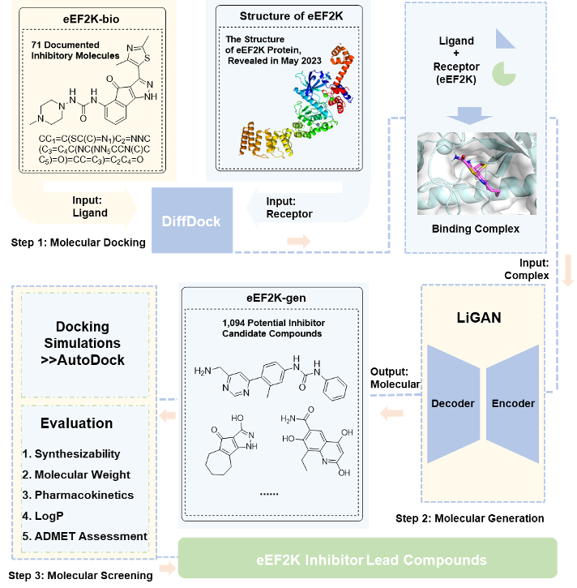

# eEF2K

This is the official implementation of the paper titled "Developing Lead Compounds of eEF2K Inhibitors Using Ligand-Receptor Complex Structures".



## The collection eEF2K-bio

1. [ChEMBL Searhch for `eEF2K`](https://www.ebi.ac.uk/chembl/g/#browse/activities/filter/target_chembl_id%3ACHEMBL5026%20AND%20standard_type%3A(IC50%20OR%20Ki%20OR%20EC50%20OR%20Kd)%20AND%20_exists_%3Astandard_value%20AND%20_exists_%3Aligand_efficiency) -> 75 ligands -> remove_duplicates -> 71 ligands -> `ChEMBL-mols.csv`

## eEF2K protein structure

1. The crystal structure downloads from [RCSB Protein Data Bank (RCSB PDB)](https://www.rcsb.org) released on May 31st.
   1. `8GM4` Functional construct of the Eukaryotic elongation factor 2 kinase bound to an ATP-competitive inhibitor
   2. `8GM5` Functional construct of the Eukaryotic elongation factor 2 kinase bound to Calmodulin, ADP and to the A-484954 inhibitor and showing two conformations for the 498-520 loop
   3. `8FNY` Nucleotide-bound structure of a functional construct of eukaryotic elongation factor 2 kinase.
   4. **8FO6** Nucleotide-free structure of a functional construct of eukaryotic elongation factor 2 kinase.
2. Protein Cleaning and Preprocessing (using Maestro): Force Field OPLS4
   1. Removal of hydration and addition of hydrogen atoms to ions
   2. Elimination of non-protein components
   3. Repair and filling of missing atoms or residues
   4. Standardization of nomenclature and correction of errors
   5. Energy minimization of protein structure
   6. Further removal of water molecules using `PyMOL`

```bash
select water, resn hoh   # Select water
select atp, resn atp     # and ATP
remove water
remove atp
save 8fo6_cleaned.pdb
```

## Blind doking using DiffDock

- `diffdock` > `eEF2K`
- use env `diffdock`

```bash
# sdandard configure
python inference.py --protein_path data/eEF2K/8gm4_protein.pdb --ligand_description data/cdk2/CHEMBL364805.sdf --out_dir results/cdk2 --inference_steps 20 --samples_per_complex 40 --batch_size 5 --actual_steps 18 --no_final_step_noise
```

- for `eEF2K` batch

```bash
python inference.py --protein_ligand_csv data/eEF2K/protein_ligand.csv --out_dir results/eEF2K --inference_steps 25 --samples_per_complex 10 --batch_size 5 --actual_steps 25 --no_final_step_noise
```

## Molecule generation using LiGAN

```bash
python3 generate.py config/generate_eEF2K.config
```

## Get Vina score using AutoDock

1. `8fo6_cleaned.pdb` -> copy -> `8fo6_receptorHpdb`
2. `` Get docking box with PyMOL plugin [GetBox-PyMOL-Plugin](https://github.com/MengwuXiao/GetBox-PyMOL-Plugin/blob/master/README.md)

```bash
autobox 8
```

### The Vina score cacluation of ChEMBL-bio and ChEMBL -gen

1 Preparing the receptor and the ligand
1.1 Slpit the ligand first if the input is complex using `pymol`: `1gih.pdb` -> `1gih_receptorH.pdb`

```bash
cd examples/eEF2K/autodock

mamba activate zsl
python ~/zsl/RDKit/add_H.py 8fo6_ligand.sdf
mk_prepare_ligand.py -i 8fo6_ligandH.sdf -o 8fo6_ligand.pdbqt

set_autodock
reduce 8fo6_receptor.pdb > 8fo6_receptorH.pdb
prepare_receptor -r 8fo6_receptorH.pdb -o 8fo6_receptor.pdbqt
```

The docking box was configured with the following parameters

```bash
ligand = 8fo6_ligand.pdbqt
receptor = 8fo6_receptor.pdbqt
out = 8fo6_ligand_ad4_out.pdbqt

center_x = -20.731
center_y = -20.851
center_z = -37.757
size_x = 55
size_y = 56
size_z = 57
seed = 1234
```

Saved as `8fo6_receptor_vina_box.txt`

```bash
vina --receptor 8fo6_receptor.pdbqt --ligand 8fo6_ligand.pdbqt --config 8fo6_receptor_vina_box.txt --exhaustiveness 32 --out 8fo6_ligand_vina_out.pdbqt >> 8fo6_ligand_vina_out.log
```

Batch Docking

```bash
cd examples/eEF2K/

mamba activate zsl
# using obabel split all *.sdf
ls molecules_unpacked | grep ".sdf" | xargs -I{} obabel molecules_unpacked/{} -O sdfs/{} -m

# move valid sdf to ligands
# addH for ligands
mkdir -p ligandsH
ls ligands | grep ".sdf" | xargs -I{} python ~/zsl/RDKit/add_H.py ligands/{} ligandsH/{}

mkdir -p ligands_pdbqt
ls ligandsH | grep ".sdf" | xargs -I{} mk_prepare_ligand.py -i ligandsH/{} -o ligands_pdbqt/{}.pdbqt

set_autodock
mkdir -p vina_out
ls ligands_pdbqt | grep ".pdbqt" | xargs -I{} vina --receptor autodock/8fo6_receptor.pdbqt --ligand ligands_pdbqt/{} --config autodock/8fo6_receptor_vina_box.txt --exhaustiveness 32 --out vina_out/{} >> 8fo6_ligand_vina_out.log
```
